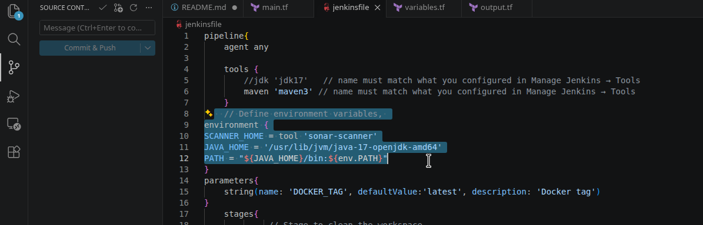
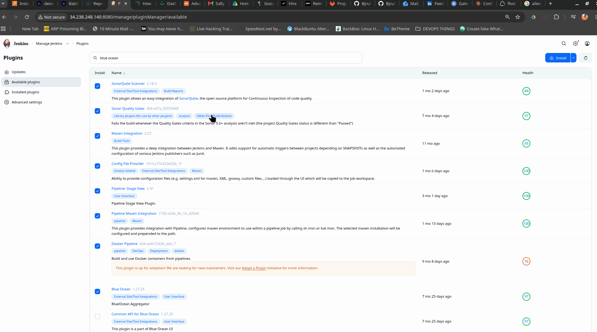
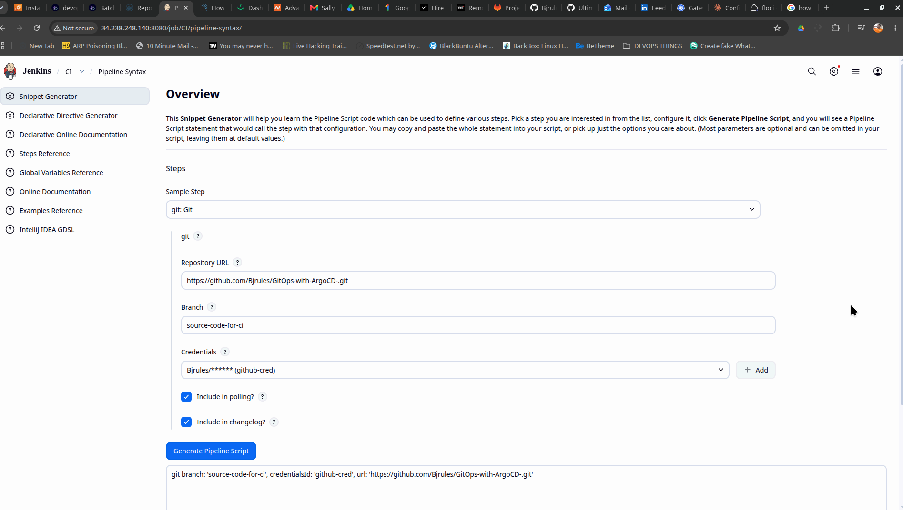

# GitOps-with-ArgoCD-
Implementing GitOps Practices using ArgoCD 
It is Important to know the difference between Traditional CICD and GitOps and the Advantages of using the both of them.

 In this project, I successfully set up a complete CI (Continous Integration) pipeline using various DevOps tools on an AWS EC2 and EKS. I started by configuring essential services like Jenkins, Docker, SonarQube and Nexus to ensure seamless code integration, quality checks and artifact management.I made sure that Jenkins Continous Integration Pipeline is done on this branch "CI-main" of this repo https://github.com/Bjrules/GitOps-with-ArgoCD-.git and it had to update the "CD-GitOps" branch of this very Repository with the latest Docker build version with tagging it correspondingly. Then I setup ArgoCD on EKS cluster, for deploying applications on Kubernetes with it's pull-base technology(from the GitOps branch) for automated reconciliation of both Desired-state and Actual-state(EKS-Cluster). Thus, a seamless automation for deployment using Git as the "single point of truth" and that was how I built a robust and scalable environment for continuous delivery. 
> NB: GitOps with ArgoCD kind of automation wrrks for both Infrastructure and Application Deployments.

 Note: Jenkins now works on jdk21 but since I am deploying a java SpringBoot application that works on jdk17, I had to install the both of them, but if I do ` sudo update-alternatives --config java` and select jdk17, jenkins Server then crashes almost irrevokably. so the option is to set jdk 17 `JAVA_HOME` and `PATH` in the `environment` section of the pipeline see screenshot below.



## Project Steps.
Set Up the Following EC2 of t2.medium each
1. Infra Server (for EKS Setup)
2. Jenkins Server (For CI pipeline)
3. SonarQube Server (for SAST)
4. Nexus (for Artifact Storage and versioning)

### Install and Configure JENKINS

```
sudo apt update
sudo apt install fontconfig openjdk-21-jre-headless -y
java -version   # confirm it shows 21

sudo wget -O /etc/apt/keyrings/jenkins-keyring.asc \
  https://pkg.jenkins.io/debian-stable/jenkins.io-2026.key

echo "deb [signed-by=/etc/apt/keyrings/jenkins-keyring.asc]" \
  https://pkg.jenkins.io/debian-stable binary/ | sudo tee \
  /etc/apt/sources.list.d/jenkins.list > /dev/null

sudo apt update
sudo apt install jenkins -y

sudo systemctl enable jenkins
sudo systemctl start jenkins
sudo systemctl status jenkins
```
> Install Jenkins plugins

---

